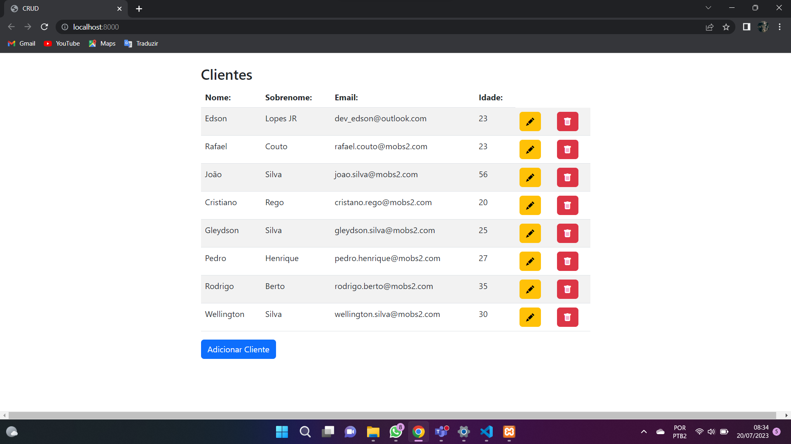
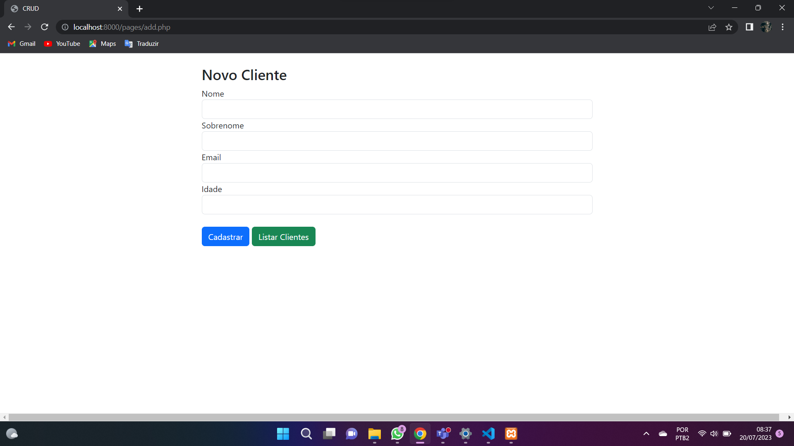
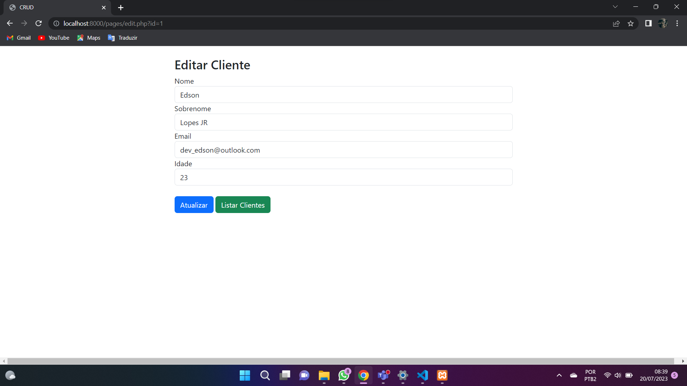
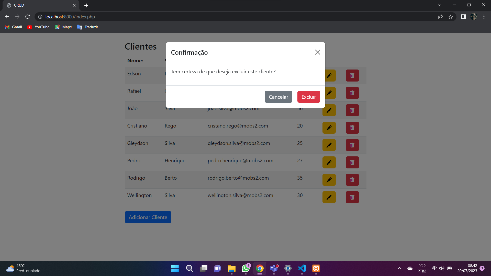

# PHP-CRUD

Esse projeto é um desenvolvimento **procedural** para reforçar meu aprendizado, aprendendo fazer conexão com o banco de dados e fazendo Manipulação CRUD.

## Tecnologias Utilizadas

- PHP
- MySQL
- Bootstrap

## Sobre

É um projeto que automatiza comandos SQL para fazer SGBD para um banco de dados, pelo o qual ele está conectado, ele faz Inserção de dados, Atualiza, Edita e Mostra todos os dados que estão dentro do banco.

- Lista dos Clientes armazenados:



- Inserção de Cliente:



- Edição de dados do Cliente:



- Deleta os dados Usuário: 



### Execução do projeto

No diretorio raiz do projeto execute o comando:

```csharp
    php -S localhost:8000
```

No direito ./db execute o comando:

```csharp
    php -S localhost:5000
```

Isso irá abri um servidor para o projeto e para o banco de dados embutido no proprio php.